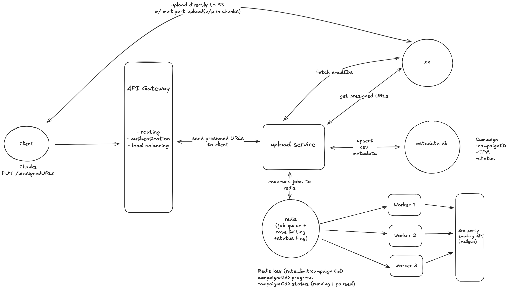

# Email Campaign System 

## Functional Requirements
Worker pool consusumer logic for mailing 
User should be able to Upload  a CSV
Execute API should send emails
User should be able to Pause and resume the campaign
User should be able to See the progress of sent emails
User should be able to Maintain a TPM

## Overview
A distributed email campaign system built in Go with:
- CSV upload via S3 multipart presigned URLs
- Redis-based worker pool for sending emails
- Configurable rate limiting (TPM) per campaign
- Pause/Resume control flag (distributed-safe)
- Progress tracking (sent/failed/pending)
- Retry and reconciliation for fault recovery

## Flow

Client uploads CSV (presigned S3 link)
        ↓
Server enqueues jobs (one per email) into Redis
        ↓
Worker pool picks jobs from Redis concurrently
        ↓
Each worker sends an email through provider (API call)
        ↓
Rate limiter ensures we don’t exceed X per minute (TPM)
        ↓
Progress stored (how many done, pending, failed)
        ↓
You can pause/resume by toggling a flag



## Key design decisions

- Go + Redis for scalability and reliability
- Presigned S3 uploads to offload large CSV ingestion
- Redis lists for atomic job claiming, ensuring no duplicate job processing
- Per-campaign rate limiting (TPM) configurable in Redis
- Distributed pause/resume control via Redis flag
- Redis hashes for real-time progress and ZSETs for retries
- Simplified but extensible architecture (can evolve to SQS/Kafka + token-bucket rate limiting)

## Endpoints

### Upload Flow
| Method | Endpoint | Description |
|---------|-----------|-------------|
| `POST` | `/campaigns/{id}/upload/init` | Get presigned S3 URLs to upload CSV parts |
| `POST` | `/campaigns/{id}/upload/complete` | Complete S3 multipart upload; triggers CSV parsing |
| `POST` | `/campaigns/{id}/upload/abort` | Abort an ongoing S3 multipart upload |
| `POST` | `/campaigns/{id}/upload` | (Small files only) Upload CSV directly |

### Campaign Controls
| Method | Endpoint | Description |
|---------|-----------|-------------|
| `POST` | `/campaigns/{id}/start` | Start a campaign worker pool |
| `POST` | `/campaigns/{id}/pause` | Pause campaign (stop sending) |
| `POST` | `/campaigns/{id}/resume` | Resume paused campaign |
| `GET`  | `/campaigns/{id}/status` | Get campaign progress + rate info |
| `POST` | `/campaigns/{id}/rate-limit` | Set TPM (transactions per minute) dynamically |

## Run Locally

```bash
docker-compose up --build
```

Then visit: [http://localhost:8080](http://localhost:8080)

## Environment Variables
| Variable | Default | Description |
|-----------|----------|-------------|
| `REDIS_ADDR` | `localhost:6379` | Redis connection address |
| `S3_BUCKET` | `my-bucket` | Target S3 bucket name |
| `WORKERS` | `10` | Number of worker goroutines |
| `PORT` | `8080` | HTTP port |
| `SENDGRID_API_KEY` | *(optional)* | To send via SendGrid |

## curl requests

Start campaign
curl -X POST http://localhost:8080/campaigns/c1/start

Pause campaign
curl -X POST http://localhost:8080/campaigns/c1/pause

Resume campaign
curl -X POST http://localhost:8080/campaigns/c1/resume

Get campaign status + progress
curl http://localhost:8080/campaigns/c1/status


Example response:

{
  "done": 1200,
  "failed": 45,
  "pending": 3800,
  "rate_limit": 1000,
  "status": "running"
}

Rate Limiting (Transactions Per Minute)

Set a custom rate limit dynamically per campaign:

curl -X POST http://localhost:8080/campaigns/c1/rate-limit \
--header 'Content-Type: application/json' \
--data '{"tpm": 600}'

Reconciliation and Retries

curl -X POST http://localhost:8080/campaigns/c1/reconcile
